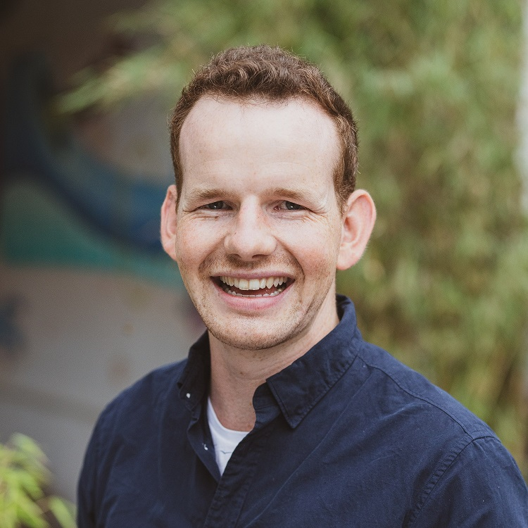

+++
title = "Über mich"
draft = false
image = ""
description = ""
+++

## Sandro Schmid

mail@sandroschmid.blog

Meine Leidenschaft ist es, wirkungsvoll gemeinsame Projekte umzusetzen und dabei Spass zu haben.

Mit ca. 60% meiner Arbeitszeit investiere ich mich mit [SAS Architektur & Beratung GmbH](www.sas-architektur.ch) im erschaffen von Lebensräumen. Sei dies soziologischer oder auch architektonischer Art. 

Ungefähr 20% und mehr geht in das Community-Building und in den Betrieb vom [Hirschengraben Coworking + Innovation](www.hirschengraben.org).\
Die restliche Zeit engagiere ich mich in Personen, lehre und lerne ich oder erweitere meinen Horizont durch neue Herausforderungen und Projekte.